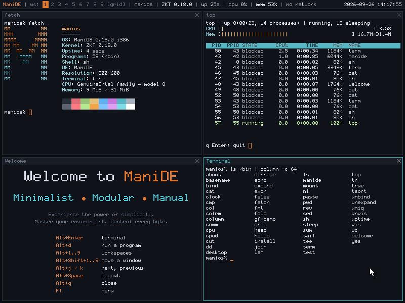

# ManiDE, the ManiOS desktop — design

**Status:** ManiDE is milestone M18 ([notes](../milestones/M18-manide.md));
it grew out of the M12 desktop ([notes](../milestones/M12-desktop.md)).
Section 8 is direction, not commitments.
**Date:** 2026-09-26
**Decision records:** [ADR-0004](../adr/0004-window-system-as-a-file-server.md)
(the window system is a file server),
[ADR-0007](../adr/0007-manide-tiling-desktop.md) (tiling; the desktop
gives windows their size)

The founding proposal (§1.4) deferred the desktop to its own design
document "when the project reaches that milestone". This is that
document. It follows the proposal's shape: what we want, the principles
that decide trade-offs, the architecture, what it contains, and what is
left for later.



*ManiDE 0.18 in QEMU at 800×600, as it starts: its session file opens
`fetch`, the welcome, `top` and a terminal, tiled in a grid.*

## 1. Goals

1. **A desktop that is ManiOS's own.** ManiDE — *minimalist, modular,
   manual* — is a tiling desktop: panes that share the screen without
   overlapping, nine workspaces, a status bar of facts, a dark theme.
   Not a port or a theme of an existing environment; its look (§6) and
   structure (§3) are designed here.
2. **Runs where ManiOS runs.** An i386 with no FPU, a Bochs/VBE or
   compatible linear framebuffer, a PS/2 keyboard and mouse, and tens of
   megabytes of memory. Integer arithmetic only; no GPU.
3. **Consistent with the rest of the system (ADR-0003).** Windows,
   input and the screen are reached as files in a namespace, through the
   same protocol (ZRP) that reaches another machine's files. A program
   drawing a window uses `open`, `read` and `write`; so does a program on
   another node (`cpu`, M13).
4. **Driven from the keyboard.** Everything has an Alt binding; the
   mouse works too.
5. **Small enough to understand.** One ManiDE process, one small client
   library, and a handful of programs.

Non-goals for now: hardware acceleration, floating windows, multiple
screens, fonts other than the ManiOS font, drag and drop, clipboard,
notifications, a file manager and a settings application (§8 orders
these).

## 2. Principles

- **The window system is a file server.** ManiDE serves a small tree,
  `/dev/wsys`, and programs are its clients. There are no window system
  calls in the kernel and no special IPC: the kernel only learned to
  carry ZRP over a pipe (`mountfd`, M12), which any program can use to
  serve files.
- **ManiDE places windows; programs draw them.** ManiDE decides each
  window's pane and offers the program its size; the program draws at
  that size (ADR-0007).
- **Processes as event sources.** A client that must wait for several
  things (keys and a shell's output, say) runs a small helper process per
  blocking source, as Plan 9's libevent does, and polls pipes.
- **ManiDE owns the hardware.** Only it opens `/dev/fb`, `/dev/kbd` and
  `/dev/mouse`; programs see only their window.
- **Text in, text out.** Control and event messages are short text lines,
  readable with `cat` and writable with `echo`, like the rest of the
  system's device files. Pixels are the one binary format. The status
  bar's facts are text files too (`/dev/sysstat`, `/dev/ps`, `/dev/net`).
- **Integer-only, damage-driven drawing.** Nothing is redrawn that did not
  change; everything is recomposed from the window images on demand.

## 3. Architecture

```
  +---------+  +---------+  +------+  +-------+  +-------+
  | term    |  | welcome |  | clock|  | about |  | ...   |   programs (libwin)
  +----+----+  +----+----+  +--+---+  +---+---+  +---+---+
       |  open/read/write /dev/wsys/...   |          |
       v                                  v          v
  --------------- kernel VFS + ZRP client (channel) ---------------
       |  one pipe, many requests in flight
       v
  +---------------------------------------------------------------+
  | manide   /dev/wsys server | tiling, workspaces | compositor   |
  |          status bar       | menu, run prompt   | keys, mouse  |
  +---------------------------------------------------------------+
       |                 |              |                 |
   /dev/fbctl, /dev/fb   /dev/kbd    /dev/mouse    /dev/sysstat, /dev/net,
                                                   /dev/sysname, /dev/time
```

- **`manide`** is a single process. It switches the display to a
  graphics mode, forks its namespace, and serves `/dev/wsys` over a pipe:
  a helper it starts (`manide -m`) mounts the pipe's other end *after*
  `/dev` (a union, ADR-0003), so `/dev/cons` and friends stay where they
  are and `/dev/wsys` appears beside them — for ManiDE and every program
  it starts, and for no one else. Then it runs its session file.
- **Tiling** (`tile.c`). Windows are kept in one order. Each workspace
  shows its own windows in that order, in its layout:

  | Layout | Panes |
  |---|---|
  | grid (the default) | ⌈√n⌉ columns side by side, the windows shared out among them, later columns taking one more when they don't divide evenly |
  | tall | the first window on the left (55% of the width; Alt+h / Alt+l change it), the others stacked on the right |
  | mono | the focused window alone, as large as the screen |

  A pane is a 1-pixel edge, a 15-pixel strip with the title and a close
  mark, and the content, where the window's image goes. Panes have 4
  pixels between them and around them. Whenever a window's pane changes
  size, ManiDE sends it `r W H`.
- **Composition** is done in a back buffer in memory (32-bit pixels),
  limited to the damaged rectangle, then copied to `/dev/fb` (in one
  write when whole rows changed). Layers, bottom to top: the desk, the
  panes (edge, strip, image), the status bar, the menu, the pointer.
  Image writes come in pieces; ManiDE handles a burst of requests,
  waiting a few milliseconds for the next piece, before composing.
- **Input.** Keys from `/dev/kbd` go to the focused window, except
  ManiDE's own (§5). A key pressed with Alt arrives as the byte
  `ZKT_KEY_ALT` and then the key. The pointer is drawn by ManiDE; mouse
  reports from `/dev/mouse` move it, and clicks focus a pane, close one
  from its strip's close mark, pick a workspace or open the menu from
  the bar, or reach the program inside its pane.
- **Programs** link `libwin`, which opens a window, keeps a canvas for
  it, sends damaged rows to the window's image, turns the event file into
  structured events, and takes the sizes ManiDE offers.

## 4. The window system's files

Mounted at `/dev/wsys` in ManiDE's namespace:

| File | Operations |
|------|------------|
| `new` | A clone file. Write `WIDTH HEIGHT TITLE` to make a window (the image's first size, in pixels); read to get its number. The window lives as long as this file stays open: closing it — or the program exiting — closes the window. |
| `N/ctl` | Read: `N X Y WIDTH HEIGHT FOCUSED TITLE` (where the image's top-left is on screen, and the image's size). Write: `title TEXT`; `top` (show its workspace, focus it); `size W H` (the image is now W×H: what fits of the old stays); `ws N` (move it to workspace N, 1–9). |
| `N/image` | Pixels: 4 bytes each, `0xAARRGGBB` little-endian (alpha ignored), row-major, at byte offset `(y × WIDTH + x) × 4`. The pane shows them at once, at its top-left, cut to the pane. |
| `N/event` | Read: blocks until there are events, then returns whole lines: `k CODE` (a key: ASCII, or `ZKT_KEY_*`), `k CODE a` (a key pressed with Alt that ManiDE doesn't keep), `m X Y BUTTONS` (pointer in window coordinates, while over the focused window or while a button pressed inside it is held), `f 1` / `f 0` (focus gained or lost), `r W H` (the pane's size: redraw at it after writing `size W H`), `c` (asked to close — Alt+q or the close mark; the program decides). End of file once the window is gone. |

Keys are delivered as the kernel's `/dev/kbd` bytes, so a program sees
exactly what a text program would (Ctrl+letter as a control character).

Why these choices:

- A clone file ties a window's life to an open file, so a crashed
  program's window disappears with it — the kernel clunks every fid a
  dying process held.
- The size is offered and taken, not imposed (ADR-0007): image writes
  already in flight were made for the old size, and the `size` write
  puts the change in order among them on the program's one connection.
  A program that never takes it still shows, at its own size.
- Offset-addressed image writes need no protocol of their own: the
  kernel's VFS splits large writes into messages (of 16 KiB since M18)
  and a program can send only the rows it changed. A drawing protocol
  (Plan 9's `/dev/draw`) would cut bandwidth further (§8).
- Event reads are *deferred* by the server (`zsrv`) until there is
  something to say. The kernel's channel transport keeps any number of
  requests in flight, so a blocked event read does not stop the same
  program's image writes, or anyone else's.

## 5. ManiDE's parts

| Component | Source | What it does |
|-----------|--------|--------------|
| `manide` | `desktop/manide/` | Mode set, `/dev/wsys` server, tiling, workspaces, status bar, menu, run prompt, compositor, pointer. `manide [-n \| -s SESSION] [WIDTH HEIGHT]`: 800×600 by default; `-n` starts no session. `desktop` is the same, by its old name. |
| `libwin` | `desktop/libwin/` | `win_open`, `win_flush`, `win_next` (events, with a timeout; `WIN_RESIZE` after resizing the canvas), `win_resize`, `win_close`, and the event helper process. |
| `term` | `desktop/apps/term.c` | A terminal of any size running `sh` through pipes, with local line editing, 256 lines of scroll-back (PgUp, PgDn), and the ANSI escapes full-screen programs use: SGR colours (16), cursor position and movement, erasing, hiding the cursor, and the size (`ESC [ 18 t`) and cursor (`ESC [ 6 n`) queries. `term COMMAND` types COMMAND into the shell once it is ready. |
| `welcome` | `desktop/apps/welcome.c` | *Welcome to ManiDE*, its motto and its keys. |
| `clock` | `desktop/apps/clock.c` | The time (UTC) from `/dev/time`, as large as its pane allows. |
| `about` | `desktop/apps/about.c` | What this system is. |
| `fetch`, `top` | `userland/bin/` | Text programs for any terminal (ManiDE's, the text console, a serial line): the system at a glance beside the ManiOS logo, and the processes, busiest first, with CPU and memory bars. |

**The status bar**, left to right: *ManiDE* (click: the menu); the
workspaces 1–9 (the one shown in amber, those in use brighter; click to
show one); the layout; then the facts — host, `ZKT` and the version,
uptime, CPU busy over the last second, memory in use, the first network
interface and its address — and the date and time (UTC) at the right.
The facts come from `/dev/sysname`, `/dev/sysstat`, `/dev/net` and
`/dev/time`, read once a second.

**Keys.** ManiDE keeps Alt with these, and F1; the rest go to the
focused window:

| Keys | |
|---|---|
| Alt+Enter | a terminal |
| Alt+d | the run prompt, in the status bar: a command line; Tab completes a program's name from `/bin`, Enter runs it, Escape leaves |
| Alt+1 … Alt+9 | show a workspace |
| Alt+Shift+1 … 9 | move the focused window to a workspace |
| Alt+j, Alt+Tab / Alt+k | focus the next / previous window |
| Alt+Shift+J / K | move the focused window along the order |
| Alt+h / Alt+l | narrow / widen the first pane (tall) |
| Alt+Space | the next layout |
| Alt+q | close the focused window (it is sent `c`) |
| Alt+Shift+Q | exit ManiDE |
| F1 | the menu: Terminal, System info (`term fetch`), Processes (`term top`), Welcome, Clock, About ManiOS, Exit ManiDE |

**The session**, `/boot/etc/manide` unless `-s` names another file:
one command a line, each started once the one before has its window (or
has exited, or had three seconds), so the panes come in the file's
order; `#` starts a comment, and `workspace N` sends the windows after it
to workspace N. ManiOS's:

```
term fetch
welcome
term top
term
```

**Exiting** (Alt+Shift+Q, or the menu) closes every window, waits
(briefly) for the programs to finish, restores the text console with
everything printed meanwhile (M11), and gives the keyboard back to it.

## 6. Visual identity

Dark and quiet, one cold colour for the focus and ManiOS's warm amber
for what is current; drawn entirely with the ManiOS font and flat
shapes, no bitmaps other than the pointer.

| Element | Colour |
|---------|--------|
| Desk (between panes) | `#0A0D12` |
| Status bar | `#12161E`, a 1-pixel `#2A313C` rule under it; *ManiDE* and the shown workspace in amber `#E07A2E` |
| Pane edge | `#2A313C`; the focused pane's `#3FC8D8` (cyan) |
| Pane strip | `#171C25`; the title in `#6B7483`, the focused pane's in cyan |
| Pane (empty part), terminal background | `#0F1319` |
| Text | `#D8DEE9`; dim text `#6B7483` |
| Menu | `#1A202A`, the selected item cyan |

The terminal's sixteen ANSI colours are a soft palette on that
background, bright yellow a warm amber.

Geometry: status bar 18 px; pane strip 15 px; 1-pixel edges; 4-pixel
gaps. An empty workspace shows the name and the main keys, dimly.

## 7. Risks and limits

| Risk / limit | Mitigation |
|---|---|
| Pixel traffic: a pane of 392×269 is ~420 KB through the kernel, and every retiling makes programs redraw | Clients send only changed rows; 16 KiB messages; ManiDE composes a burst of writes at once, and only the damage. A drawing protocol (§8) is the real fix. |
| Memory: each window's image is held twice (the program's canvas and ManiDE's copy), and a window that was once large leaves its program's heap large | 800×600 by default; a 32 MiB machine runs the session and more. |
| One ManiDE process: a bug there takes every window down | Programs see end of file and exit; the text console comes back when ManiDE exits. |
| Alt taken by the host (some remote consoles) | F1's menu and the mouse reach the main functions. |
| Old hardware without VBE | ManiDE needs a linear framebuffer of at least 640×480; on VGA alone it says so and exits. |
| A client that stops reading events | Events queue per window up to a limit; pointer moves fold together, keys are dropped only when the queue is full. |

## 8. Later

In rough order: a `/dev/draw`-style protocol (images held by the
server, draw operations sent instead of pixels); per-workspace sessions
and a settings file for keys and colours; floating windows for dialogs;
notifications; a file manager. Running programs on another node whose
windows appear here has worked since M13 without any change to the
window system: `cpu`, typed in a terminal, exports ManiDE's namespace,
and the program on the CPU server finds `/dev/wsys` in it.
