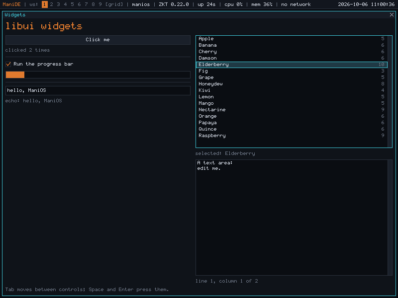
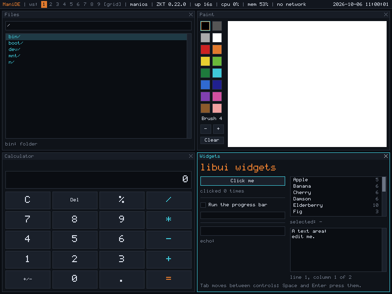

# Graphical programs on ManiOS

ManiOS has graphical software, and a toolkit to write more. This is the
guide: what ships, how to run it, and how to write a graphical program
of your own with **libui**, ManiOS's widget toolkit (milestone M23,
[notes](milestones/M23-gui-software.md),
[ADR-0009](adr/0009-libui-widget-toolkit.md)).


## The programs

| Program | What it is | Source |
|---|---|---|
| `files [DIR]` | A file browser: folders first, with sizes. Enter or a double click opens a folder, or a file in `view`; Backspace goes up; type a path in the box at the top; F5 lists again | `desktop/apps/files.c` |
| `view [FILE]` | Shows a text file with line numbers (up to 256 KiB). Arrows, PgUp, PgDn, Home, End scroll; Space and `b` page; `q` closes | `desktop/apps/view.c` |
| `calc` | A calculator: click the keys or type. Six decimals, eleven digits, integer arithmetic. `calc -t` checks its arithmetic with no window | `desktop/apps/calc.c` |
| `paint` | A sketchpad: sixteen colours, a brush of 1 to 24, the right button erases | `desktop/apps/paint.c` |
| `widgets` | Every libui widget in one window, to look at and to copy from | `desktop/apps/widgets.c` |
| `greet` | The smallest graphical program: the first example below | `desktop/apps/greet.c` |

Start them from ManiDE's menu (F1: Files, Calculator, Paint), from its
run prompt (Alt+d, then the name; Tab completes), or from a terminal
inside ManiDE. They need ManiDE: started anywhere else they say `no
window` and exit. None of them changes a file: `view` and `files` only
look, and `paint` keeps its picture in memory (ManiOS can write a FAT
volume since 0.23.0, but saving from a graphical program needs a place to
choose; see the limits below).



Four of them at once: each lays itself out in the quarter of the screen
ManiDE gives it, and again when the layout changes.



Every one of them is an ordinary ManiOS program: a `.c` file in
`desktop/apps/`, built into `/bin` by `make`, started like any other.
There is no registry and no manifest.

## A first program

`desktop/apps/greet.c`:

```c
#include <stdio.h>
#include <ui.h>

struct app {
	struct ui_widget *label;
	int clicks;
};

static void clicked(struct ui_widget *button, void *arg)
{
	struct app *app = arg;
	char text[32];
	(void)button;
	app->clicks++;
	snprintf(text, sizeof(text), "clicked %d time%s", app->clicks, app->clicks == 1 ? "" : "s");
	ui_set_text(app->label, text);
}

int main(void)
{
	static struct app app;
	struct ui *ui = ui_open("Greet", 240, 100);
	if (!ui) {
		fprintf(stderr, "greet: no window (is ManiDE running?)\n");
		return 1;
	}
	app.label = ui_label(ui_root(ui), "Hello, ManiOS");
	ui_button(ui_root(ui), "Click me", clicked, &app);
	ui_run(ui); /* until the window is closed */
	ui_free(ui);
	return 0;
}
```

`make` builds it as `/bin/greet`; in ManiDE, Alt+d, `greet`, Enter.
Nothing else is needed: the Makefile builds every `.c` file in
`desktop/apps/` and links it with libui, libwin, libgfx and libc.

## How a program is put together

**A ui is one window of widgets.** `ui_open(title, w, h)` makes the
window and its *root*, a vertical box; every widget is added to a
parent, and a box lays out its children. Nothing is positioned by
coordinates.

**ManiDE decides the window's size.** ManiDE tiles its windows
([ADR-0007](adr/0007-manide-tiling-desktop.md)), so the size given to
`ui_open` is only where the window starts. Whenever the pane changes,
libui lays everything out again at the new size and draws it. A program
never handles the resize itself unless it has its own widget that cares
(`resized`, below).

**Layout** (`desktop/libui/layout.c`). A box gives each child its
natural size along its direction (a label: its text; a button: its text
and 8 pixels either side; `ui_set_size` makes it at least so big), and the
child its whole width across it. Room left over is shared among the
children with `ui_set_expand`, in proportion to the numbers given. A
box too small takes room back from the expanding children first, then
from the others, last to first. `ui_hbox` lays children in a row, `ui_vbox`
in a column, `ui_grid(parent, columns, spacing)` in equal cells, row by
row. `ui_set_padding` is the space inside a box's edge.

```c
struct ui_widget *row = ui_hbox(ui_root(ui), 6);
ui_set_expand(row, 1);                      // the row takes the window's spare height
struct ui_widget *name = ui_entry(row, "", 40, on_enter, app);
ui_set_expand(name, 1);                     // the entry takes the row's spare width
ui_button(row, "Go", on_go, app);
```

**Callbacks.** A function of `(struct ui_widget *widget, void *arg)` is
given when the widget is made, or with `ui_on_change`. libui calls it
from inside `ui_run`, on the program's one thread; do the work and
return. A callback may change any widget, show a message, destroy
widgets (not the one it was called for, if it will touch it again), or
call `ui_quit`.

**The event loop.** `ui_run` reads events (keys, the pointer, focus,
the window's size, a request to close), hands each to libui, and after
a burst of them draws what changed and shows it. It returns when the
window is closed or `ui_quit` is called. Hooks:

- `ui_on_key(ui, fn, arg)`: `fn(ui, key, arg)` sees every key first and
  returns true to use it up (the calculator's keyboard is a key hook).
- `ui_on_close(ui, fn, arg)`: returning false keeps the window open
  (an unsaved-changes question, say).
- `ui_set_timer(ui, ms, fn, arg)`: one repeating timer, which `ui_run`
  fires between events; the progress bar in `widgets` and the child
  collector in `files` use it.

**The focus.** One widget has the keys: the one clicked, or reached with
Tab. Buttons, check boxes, entries, lists and text areas take the focus;
labels and boxes don't (`ui_set_focusable` changes that). Tab moves to
the next widget and round again. Shift+Tab doesn't exist: ManiDE can't tell
it from Tab. The focused widget shows a cyan border; when the window
has lost the focus the border goes grey.

**Messages.** `ui_message(ui, "text")` shows a message over the window,
with an OK button; nothing else responds until Enter, Escape, Space
or the button closes it. For errors and one-line answers; there is no
question dialog yet.

**Colours.** `ui_theme` holds ManiDE's palette (`bg`, `panel`, `field`,
`edge`, `text`, `dim`, `focus`, `accent`, `select`). Use it, and the
program looks like the rest of the desktop:
[docs/desktop/DESIGN.md §6](desktop/DESIGN.md).
`ui_set_colors(widget, bg, border)` gives a widget a fill and an outline.

## The widgets

| Make it with | Does | Keys and mouse |
|---|---|---|
| `ui_label(parent, text)` | Text, any number of lines; `ui_set_scale` (2 is double size), `ui_set_align`, `ui_set_text_color` | none |
| `ui_button(parent, text, fn, arg)` | Runs `fn` when clicked (released over it) | Space, Enter |
| `ui_checkbox(parent, text, checked, fn, arg)` | `ui_checked`, `ui_set_checked`; `fn` runs when the user toggles it | Space, Enter, click |
| `ui_entry(parent, text, max, fn, arg)` | One line of at most `max` characters; `fn` runs on Enter, `ui_on_change` on each edit; `ui_get_text` | printable keys, Backspace, Delete, Left, Right, Home, End, ^A ^E ^K ^U; click places the caret |
| `ui_list(parent, fn, arg)` | Rows with a selection and a scroll bar. `ui_list_add(list, text, color, data)`, `ui_list_clear`, `ui_list_selected`, `ui_list_select`, `ui_list_text`, `ui_list_data`. A Tab in a row's text starts a dim column at the right. `fn` runs when a row is activated; `ui_on_change` when the user selects | Up, Down, PgUp, PgDn, Home, End, Enter; click selects, double click activates |
| `ui_text(parent, readonly)` | Several lines, a caret, a scroll bar; `ui_set_text`, `ui_get_text`, `ui_text_numbers` (line numbers), `ui_text_lines`, `ui_text_line`, `ui_text_column`, `ui_text_top`, `ui_text_goto`. Tab characters show as spaces to a multiple of 4, carriage returns take no room | editable: the arrows, Home, End, PgUp, PgDn, Backspace, Delete, Enter, ^K, printable keys; read-only: the arrows, PgUp, PgDn, Home, End scroll. Tab leaves it for the next widget. Click places the caret; the scroll bar can be dragged |
| `ui_progress(parent)` | A bar: `ui_set_progress(bar, value, max)` | none |
| `ui_separator`, `ui_spacer` | A thin line across the box; empty space that takes spare room | none |
| `ui_custom(parent, ops, arg)` | A widget the program draws and handles itself (below) | as the program says |

Every widget also has `ui_set_enabled`, `ui_set_visible`, `ui_set_size`,
`ui_set_expand`, `ui_focus`, `ui_redraw` and `ui_destroy`.

## Drawing and handling the mouse yourself

Where the widgets don't do what a program needs, `ui_custom` makes a
widget the program owns. `paint` is made of two (`desktop/apps/paint.c`):
the palette, and the page.

```c
struct ui_custom ops = {
	.paint = my_paint,       /* draw into the canvas, inside w->r (libgfx calls) */
	.mouse = my_mouse,       /* UI_MOVE, UI_PRESS, UI_DRAG, UI_RELEASE; x, y relative to the widget */
	.key = my_key,           /* a key, when it has the focus; true if used */
	.resized = my_resized,   /* it was laid out at another size */
	.focusable = false,
};
struct ui_widget *page = ui_custom(parent, &ops, my_state);
ui_set_expand(page, 1);
```

Drawing is libgfx (`desktop/libgfx/gfx.h`): a canvas of 32-bit pixels,
rectangles, lines, circles, blending, text in ManiOS's 6x11 font; all
integer arithmetic. After changing what a widget shows, `ui_redraw(w)`
draws it again, or `ui_redraw_rect(w, r)` just a rectangle of it, as
`paint` does for each stroke. Mouse events for a press that began inside
the widget keep coming, even outside it, until the buttons are released;
the button mask is 1 left, 2 right, 4 middle.

Below libui is **libwin** (`win_open`, `win_next`, `win_flush`): a
window, a canvas, and events as they come, with nothing between a program
and ManiDE's files. `welcome`, `clock` and `term` are written that way,
and a program that wants no toolkit can be too
([docs/desktop/DESIGN.md §4](desktop/DESIGN.md)). The window system
itself is a file server, `/dev/wsys`.

## Testing a graphical program

A ui needs no desktop to be tested. `ui_new(w, h)` makes a ui that draws
on a canvas of its own; feed it `struct win_event` values with
`ui_handle`, call `ui_update`, and read the result with `ui_canvas_of`
and the widgets' own state. `userland/test/uitest.c` does this for the
whole toolkit: `/boot/test/uitest` runs from any shell. Programs with an
engine that can be separated from the window (the calculator's
arithmetic: `calc -t`) can check it the same way.

The whole path, with real keys and a real pointer, is
`tests/gui_test.py`: it starts ManiDE under QEMU, drives each program
through the emulated keyboard and mouse, and reads the screen back. Where
a widget is on screen comes from the same layout arithmetic as
`layout.c`, written again in the test, so a layout that drifts from its
description fails.

## Rules and limits

- **No floating point.** ManiOS targets the 80386; programs are built
  without an FPU and link without libgcc, so floating-point code does not
  link. libui and libgfx are integer-only (`calc` is fixed-point).
- **Files can be written only on a FAT volume** (since 0.23.0,
  [docs/dos.md](dos.md)): `open` with `O_CREAT`, `unlink`, `mkdir` and
  `rename` work under `/n/ata0p1` and its like, and fail with `EROFS` in
  the root, the boot archive, a CD or a ZRP mount. So a program that
  saves needs a volume to save to, and a way for the user to choose it
  and a name; libui has no file chooser yet, and none of the programs
  here saves.
- **Text is ASCII.** The font has the 95 printable characters;
  anything else shows as a box (libui draws dots in `view`).
- **Alt belongs to ManiDE.** Alt+key reaches a program only if ManiDE
  doesn't keep it, and libui hands such keys to nobody. Use plain keys,
  Ctrl and the function keys for shortcuts.
- **The pointer's hover state can go stale.** ManiDE sends pointer moves
  only while the pointer is over the focused window (or a button is
  held), so a button under a pointer that has left the window stays
  lit until the window loses the focus.
- **One thread, one ui.** libui is not thread-safe, and a program has
  one ui. Work that takes long (a directory of thousands of files)
  blocks the window; start a helper process, as `term` does.
- **Memory.** A window's pixels are held twice, by the program and by
  ManiDE (4 bytes per pixel each); on a 32 MiB machine a full-screen
  800x600 program costs about 4 MiB.
- **Not there yet:** menus, tabs, question dialogs and file choosers,
  the clipboard, drag and drop, images, fonts other than the ManiOS font,
  floating windows, anything that changes how ManiDE places windows.
  [ADR-0009](adr/0009-libui-widget-toolkit.md) says which are on the way.

## Conventions

So that the programs feel like one system:

- **Tab** moves between controls; **Space** and **Enter** press the
  focused one; **Escape** cancels a message or leaves a box; **Alt+q**
  (ManiDE's) closes the window. Viewers also close with **q**.
- **Backspace** goes up or back where there is an up or a back.
- A window opens at a size where its widgets fit; it must also be
  usable in a quarter of the screen, which is where ManiDE puts the
  fourth window of a grid.
- Show errors with `ui_message`, in a sentence, with the reason from
  `strerror(errno)`; don't write to the terminal the program was started
  from, which usually isn't there.
- Use `ui_theme`'s colours, and ManiDE's cyan for focus and amber for what
  is current.
