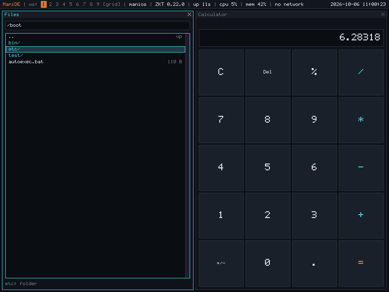

# M23 — graphical software: libui, and the programs built on it

**Status:** Achieved (2026-10-06). Released as **0.24.0**. Asked for as
"I want that we officially could have GUI software!". ManiOS had a
desktop (ManiDE) and a window system, but every graphical program drew
its own pixels with libgfx, and there were no programs to use besides
the terminal and some demonstrations. M23 gives ManiOS an official way
to write graphical software, [libui](../gui.md), and the first
programs written with it.

## What M23 delivers

| Piece | Files | Summary |
|---|---|---|
| libui, the widget toolkit | `desktop/libui/` | Boxes, grids, labels, buttons, check boxes, entries, lists, multi-line text with scroll bars, progress bars, separators, spacers, and widgets a program draws itself; layout by natural size, weight and shrinking; focus and Tab; the keyboard and the pointer; messages over the window; a timer; ManiDE's palette in one table. Integer arithmetic only. About 2,800 lines |
| `files` | `desktop/apps/files.c` | A file browser: folders first, sizes, a location box, Enter or a double click to open, Backspace to go up, F5; files open in `view` |
| `view` | `desktop/apps/view.c` | Shows a text file, with line numbers, up to 256 KiB; scrolls with the arrows, pages, Home and End, Space and `b`; DOS line ends; says so when a file isn't text |
| `calc` | `desktop/apps/calc.c` | A calculator on fixed-point numbers (eleven digits, six decimals; no FPU needed), by mouse or keyboard, with `%`, a sign key, errors for dividing by zero and for overflow; `calc -t` checks its arithmetic with no window |
| `paint` | `desktop/apps/paint.c` | A sketchpad: sixteen colours, brushes of 1 to 24, the right button erases; the example of a program drawing and handling the mouse itself (`ui_custom`) |
| `widgets` | `desktop/apps/widgets.c` | Every widget in one window |
| `greet` | `desktop/apps/greet.c` | The smallest graphical program, the guide's first example |
| ManiDE's menu | `desktop/manide/main.c` | F1 lists Files, Calculator and Paint |
| The guide | `docs/gui.md` | The programs, a first program, how a ui works, every widget, drawing, testing, rules and limits, conventions |
| The decision | `docs/adr/0009-libui-widget-toolkit.md` | A toolkit in userland over libwin and libgfx; why not ports, widgets in the window system, immediate mode, a layout language |
| Tests | `userland/test/uitest.c`, `tests/gui_test.py` | The toolkit's conformance test (no desktop), and the programs driven by QEMU's keyboard and mouse; both in `make test` |

## Design decisions

**A library, not part of ManiDE.** Widgets could have lived in the window
system. They live in each program instead, so that a bug in a list can't
take the desktop's one process down, so that the toolkit changes without
a new ManiDE, and so that a program running on a CPU server (M13) draws
the same widgets through the same files ([ADR-0009](../adr/0009-libui-widget-toolkit.md)).

**Layout is the program's description, not its coordinates.** ManiDE
tiles windows and picks their size (ADR-0007); a program that placed
widgets by pixel would break the moment another window opened. A box gives
each child its natural size and the room that is left over to the
children that ask for it, by weight, and takes room back the same way,
expanding children first. The rule is small enough to write again
elsewhere: `tests/gui_test.py` does, to know where the buttons are, so
documentation and implementation can't drift apart without a test
noticing.

**Only what changed is drawn and sent.** Each widget that changes marks
its rectangle; `ui_update` draws the union of those, and sends only
those rows of the window to ManiDE (the pixels go through the kernel, 4
bytes each). Events that are already waiting are all handled before the
next draw, so dragging the pointer across `paint` draws every point and
sends one picture. Changing a label's text to one of the same size marks
only the label; a different size lays the whole window out again.

**The calculator does its arithmetic without floating point.** A number
is a 64-bit integer times 10^-6; multiplication splits both operands into
their whole and fractional parts so no step overflows 64 bits, division
works out the six decimals digit by digit and rounds to nearest, and what
doesn't fit in eleven whole digits is an error, not a wrong answer.
Two of the self-test's cases exist because of that: operands whose
64-bit product wraps around to a number that looks valid (2^36 squared,
37,000,000 / 0.000002), found by search, which a guard in each routine
catches and a plain "too big" check doesn't.

**A text area that edits, and no program that edits.** The text widget has
a caret, Backspace, Enter, ^K and the arrows, and is tested as an editor;
the programs that use it are a viewer (`view`) and a gallery. ManiOS can
write a FAT volume since M22, but an editor needs to ask which file and
which volume (a file chooser, a question dialog), which a first toolkit
milestone shouldn't invent in passing, and an editor that can only save
to a fixed place is worse than none. The widget is ready.

**Messages are over the window, and modal.** A message dims the window
and takes every key and click until it is closed; its OK button has the
focus, so Enter closes it, and the focus returns to where it was. There is
nothing like a dialog box in a tiling desktop to be a separate window,
and a message over the window can't be hidden behind another pane.

## Verification

- `userland/test/uitest.c` (`/boot/test/uitest`, 113 checks): a
  windowless ui driven by hand: boxes, weights, shrinking, grids, hidden
  widgets, buttons (a press dragged off and back), Tab, the entry's keys,
  check boxes, the list (keys, clicks, double clicks and the time
  between them), the text widget (editing, columns, tabs, read-only
  scrolling, the scroll bar's track and thumb), labels, the progress bar,
  messages, custom widgets, key and close hooks, resizing, and the pixels
  that come out (colours of the focus, the selection, the dimmed
  window).
- `calc -t` (52 checks): the arithmetic, rounding and both overflow
  guards, with no window.
- `tests/gui_test.py` boots ManiOS under QEMU and drives ManiDE with the
  emulated keyboard and mouse: the calculator through the F1 menu (typed and
  clicked sums, an error, following its pane when a terminal opens), the
  widget gallery (clicks, Space, Tab, the progress bar, typing, messages, a
  list click and double click, the text area), the file browser (folders
  into and out of, a typed path, Enter on a file opening the viewer in a
  second pane, the viewer's line numbers and its `q`), `greet`, and paint
  (a stroke, a colour, the right-button eraser, the brush keys, Clear),
  reading the result from the screen itself, pixel for pixel.
- **Negative controls.** The tests were run against deliberately broken
  copies of the code: weights ignored by the layout, a double click that
  never counts, Backspace deleting the wrong character, a button that clicks
  when released off it, keys reaching the window under a message, the focus going back to a widget destroyed while the message was up, rounding
  down, both overflow guards removed, the eraser drawing, Backspace not
  going up in the browser, a `%` button that does nothing. Each is caught.
  The first pass found one gap, now closed: nothing noticed the program's
  key hook being called with the keys meant for a message, because the
  focus is inside the message and its own button swallows them, so
  `uitest` installs a hook and counts.

## Known limits

- None of the programs saves anything: ManiOS writes only FAT volumes
  (M22), and libui has no file chooser to pick one and a name. Nor is
  there any copy and paste (no clipboard).
- ManiDE sends pointer moves only while the pointer is over the focused
  window, so a hover highlight can stay on after the pointer has left.
- Shift+Tab is Tab: ManiDE's keyboard driver sends the same byte for
  both, so focus moves one way.
- A big mouse jump delivered in a single instant (QEMU's `mouse_move
  -778 -498` from the monitor, say) arrives short of where it was
  aimed: part of the burst of PS/2 packets is lost somewhere between the
  emulated controller and `zkt/drivers/ps2mouse.c`, which takes one byte
  per interrupt. A real mouse reports at a rate the driver keeps up with;
  the test moves the pointer in steps of 200 pixels or less. Seen, not
  chased: it is older than M23 and in the kernel.
- Menus, tabs, question dialogs, a file chooser, drag and drop, images
  and other fonts are not in libui yet
  ([the guide](../gui.md#rules-and-limits)).

## What's next

The toolkit: question dialogs and a file chooser, a menu bar, and the
clipboard as a file in the namespace. Then the first programs that
save, onto a FAT volume (M22): a text editor (the widget exists), a
paint program that saves, and a settings program; and, for programs with
no disk attached to write to, a RAM-backed `/tmp`.
